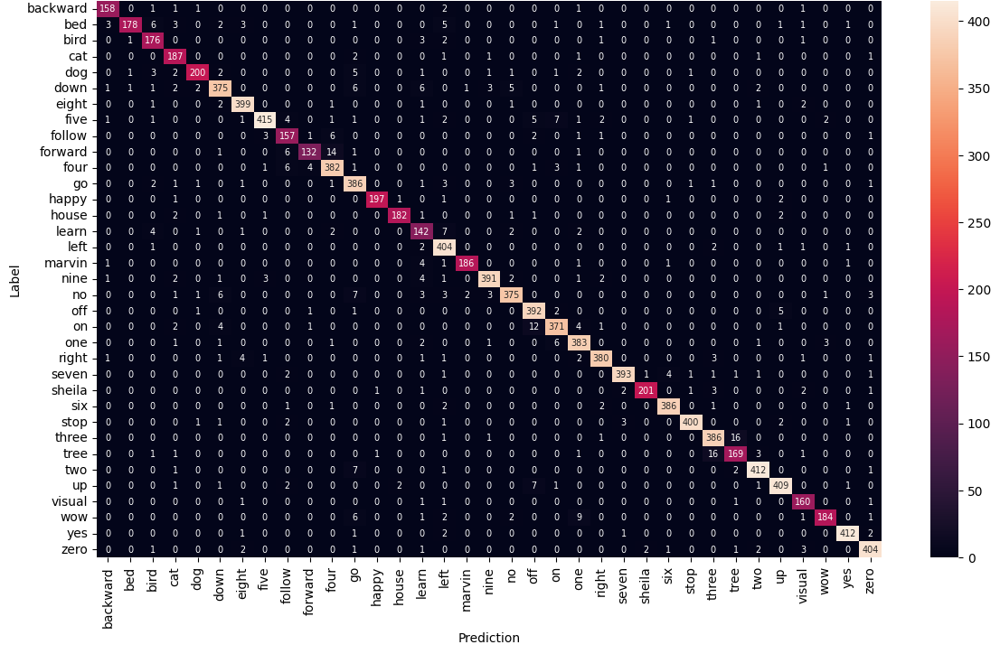

# Introduction

This repository contains tensorflow implementation of improved ViT model for speech command recognition by combining convolutional features with the attention mechanism in transformer blocks. The final trained model (100 epochs) is available at: ```./trained_models/cvit/cvit_100-0.952.h5```. The model is trained on Google Sppech Commands V2 (SCV2) dataset. The test accuracy achieved by this model is $95.08\%$. Confusion matrix is given below:



# Getting Started 

Clone or download this repository and install the pre-requisites:

- numpy
- matplotlib
- tensorflow
- tensorflow-io

```
pip install numpy matplotlib tensorflow tensorflow-io
```

## Preparing dataset:
Run the notebook ```create_mel_spectrograms.ipynb```. This will generate mel spectrograms of Google speech commands V2 dataset.

## Training model:
To train the proposed convolutional vision transformer model from scratch:
```
cd src
python train.py -m cvit
```

## Testing trained models:
```
cd src
python test.py -m "../trained_models/cvit/model.json" -w "../trained_models/cvit/cvit_100-0.952.h5"
```